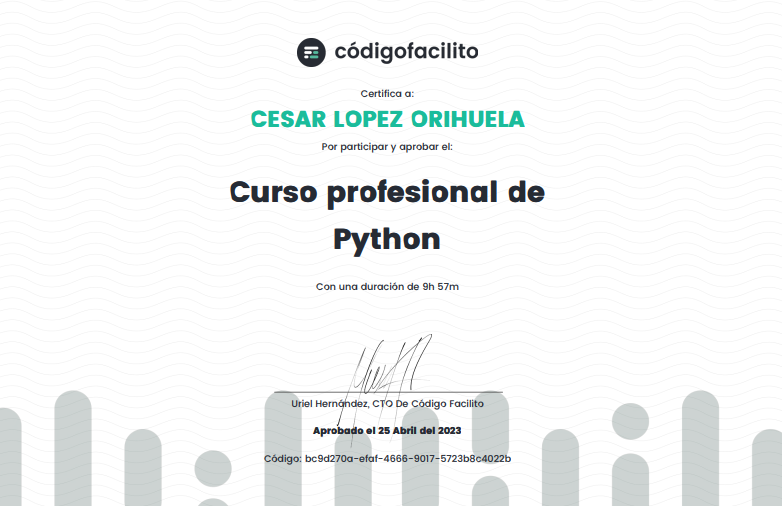
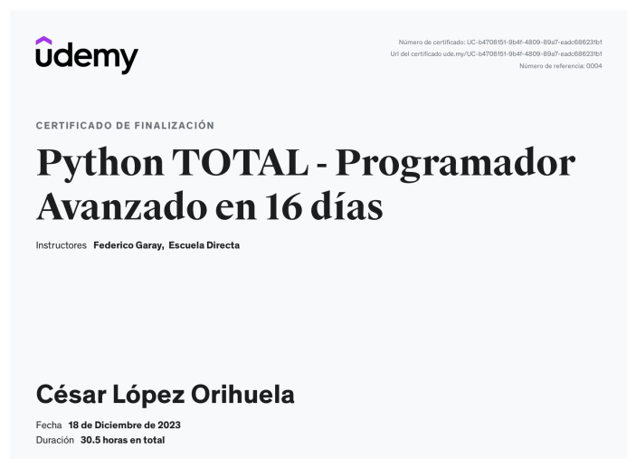

<h1 align="center" id="python">Programación Python</h1>

Repositorio que contiene todos los proyectos y ejercicios hechos en Python, con la finalidad de brindar información de mis avances y habilidades adquiridas durante las certificaciones.

## Plataformas

<section align="center">

</section>

## Programas

1. [Python](https://www.python.org/)

2. [IDE](<https://www.redhat.com/es/topics/middleware/what-is-ide#:~:text=Un%20entorno%20de%20desarrollo%20integrado,gr%C3%A1fica%20de%20usuario%20(GUI).>)

- [VSC](https://code.visualstudio.com/)
- [PyCharm](https://www.jetbrains.com/es-es/pycharm/download/?section=windows)

## Proyectos y Ejercicios

[A. Codigo Facilito](./CodigoFacilito/)

1. [Hola Mundo](holaMundo)
2. [Saludo a Usuario](saludoUsuario)

[B. YouTube](./YouTube/)

1. [Formulario](formulario)
2. [Gato](gato)
3. [Documentos automaticos](documentosPersonalizados)

[C. Udemy](./Udemy/)

## Estatus

<h4 align="center">

</h4>

## Acceso al repositorio

<section align="center">

</section>

## Tecnologías utilizadas

<section align="center">

</section>

## Certificados

[ Curso profesional de
Python](https://codigofacilito.com/certificates/bc9d270a-efaf-4666-9017-5723b8c4022b)

[  Python TOTAL - Programador Avanzado en 16 días](https://www.udemy.com/certificate/UC-b4706151-9b4f-4809-89a7-eadc686231b1/)

## Desarrollador

<section align="center">

[ Cesar Lopez Orihuela](https://github.com/Chinicuil87)

</section>

## Redes Sociales.

<section align="center">

</section>
