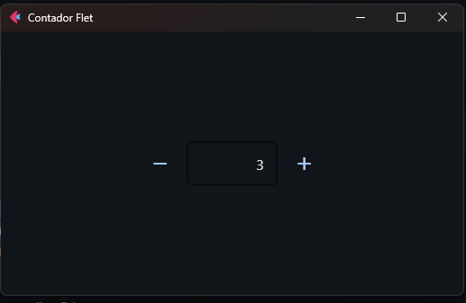
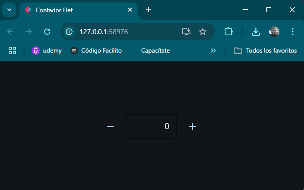

<!-- Imagen de la aplicación centrada -->

  

<!-- Nombre de la aplicación -->
<h1 align="center">Contador</h1>

<!-- Programas y tecnologías utilizadas -->

## Tecnologías

<section align="center">

</section>

## Descripción del Proyecto

Aplicación de escritorio y web que permite aumentar o disminuir un contador. Este proyecto es una introducción al uso del framework **Flet** para crear interfaces gráficas interactivas y multiplataforma con Python.

## Estado del Proyecto

<section align="center">

</section>

## Características de la Aplicación

- **Multiplataforma**: Funciona tanto en escritorio como en la web.
- **Interactividad**: Incluye botones para incrementar y disminuir un contador.
- **Sencillez**: Ideal para aprender los conceptos básicos de Flet y Python.

### Demostración

#### Versión de Escritorio

#### Versión Web

## Repositorio

<section align="center">

</section>

## Desarrollador

<section align="center">

[ Cesar Lopez Orihuela](https://github.com/Chinicuil87)

</section>

## Redes Sociales

<section align="center">

</section>
