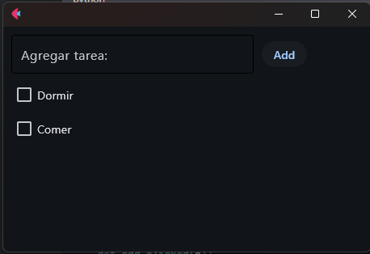
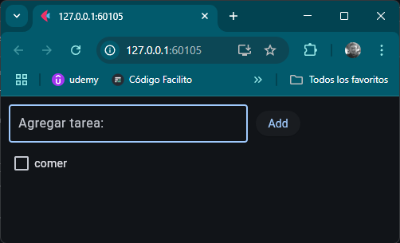

<!--Imagen de aplicacion-->

<!-- Nombre de la aplicacion-->

# <h1 align="center">Tarea</h1>

<!-- Programas y tecnologias utilizadas-->

## Tecnologias

<section align="center">

</section>

## Descripción del proyecto

Aplicacion de escritorio o web que permite agregar una lista de tareas sencilla.

## Estado del proyecto

<section align="center">

</section>

## Características de la aplicación y demostración.

> Aplicacion de escritorio o web.

> Bones de para incrementar o disminuir.

ESCRITORIO

WEB

## Repositorio

<section align="center">

</section>

## Desarrollador

<section align="center">

[ Cesar Lopez Orihuela](https://github.com/Chinicuil87)

</section>

## Redes Sociales.

<section align="center">

</section>
